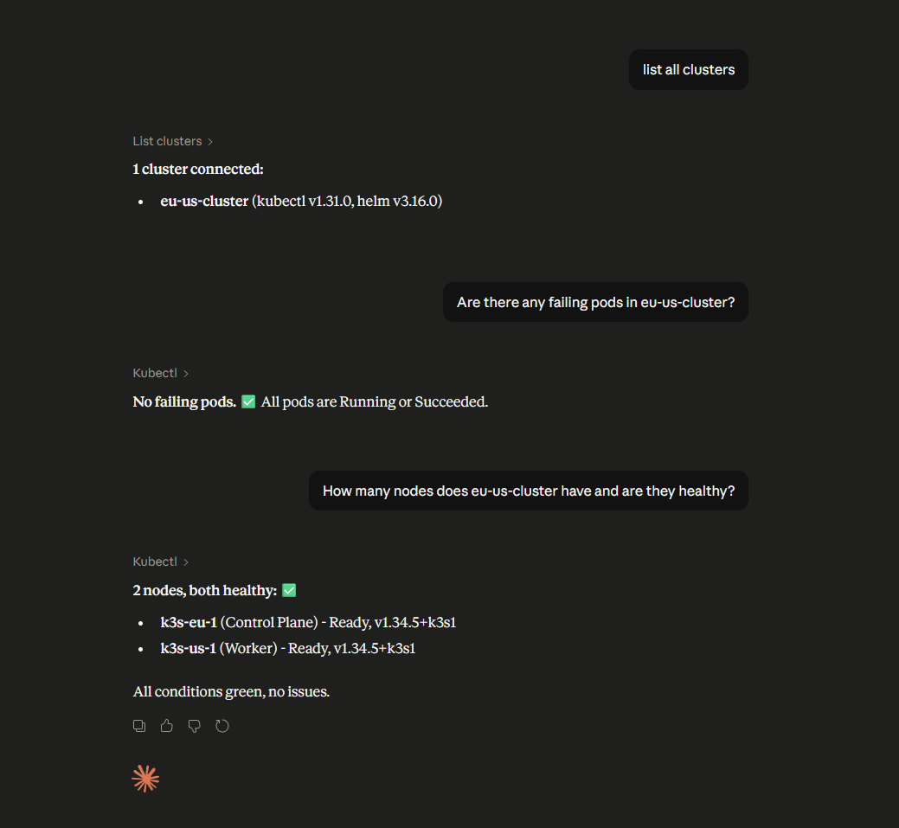

# multi-cluster-mcp

A Model Context Protocol (MCP) server that lets AI assistants (Claude, VS Code extension, etc.) query **multiple Kubernetes clusters** simultaneously using natural language.

Each cluster runs a lightweight agent that connects back to a central MCP server. The AI talks to the central server and commands are routed to the right cluster transparently.



## Architecture

```
Claude / VS Code Extension
        │  MCP over HTTP
        ▼
┌─────────────────────┐
│   Central Server    │  ← single endpoint, aggregates all clusters
│  (MCP + WebSocket)  │
└──────┬──────────────┘
       │ WebSocket (wss://)
  ┌────┴────┐
  │         │
┌─▼──┐   ┌──▼──┐
│ A  │   │  B  │   cluster agents (one per cluster)
└────┘   └─────┘
  k8s      k8s       in-cluster kubectl / helm (read-only)
```

- **Central server** — exposes an MCP HTTP endpoint and manages WebSocket connections from cluster agents.
- **Cluster agent** — deployed as a Kubernetes Deployment with a Helm chart. Uses the in-cluster service account for read-only `kubectl`/`helm` access and connects outbound to the central server.

## Features

- Query any connected cluster from a single MCP endpoint
- Per-cluster token authentication (each cluster has its own secret)
- Read-only by default — only `get`, `list`, `watch` verbs allowed
- Command injection protection — all arguments passed as arrays, no shell execution
- Blocked flags — `--server`, `--kubeconfig`, `--token`, etc. are rejected
- Output size cap (2 MB) and command timeout (55 s)
- Structured JSON logging with audit trail
- Liveness and readiness probes on the agent
- WebSocket reconnect with exponential backoff
- Per-IP WebSocket connection limit
- Agent reports kubectl and helm versions to the central server on connect

## Available MCP Tools

| Tool | Description |
|------|-------------|
| `list_clusters` | List all connected clusters with versions and last-seen timestamps |
| `kubectl` | Run a read-only kubectl command against a specific cluster |
| `helm` | Run a read-only helm command against a specific cluster |

### Example prompts

- _"What pods are running in kube-system on my prod cluster?"_
- _"List all deployments across all clusters"_
- _"Show me the Helm releases installed on staging"_
- _"Describe the failing pod on eu-cluster"_

## Prerequisites

- Kubernetes clusters (1.24+)
- Helm 3
- A container registry to push the images to
- An ingress with TLS for the central server (recommended)

## Quick Start

### 1. Build and push images

```bash
# Central server
docker build -t <your-registry>/central-server:latest \
  -f packages/central-server/Dockerfile .
docker push <your-registry>/central-server:latest

# Cluster agent
docker build -t <your-registry>/cluster-agent:latest \
  -f packages/cluster-agent/Dockerfile .
docker push <your-registry>/cluster-agent:latest
```

### 2. Deploy the central server

Generate an MCP API key and a token for each cluster agent:

```bash
openssl rand -hex 32   # MCP API key (for Claude / VS Code)
openssl rand -hex 32   # token for cluster-1
openssl rand -hex 32   # token for cluster-2
```

Install the Helm chart:

```bash
helm install central-server ./helm/central-server \
  --namespace mcp-system --create-namespace \
  --set image.repository=<your-registry>/central-server \
  --set config.mcpApiKey="<mcp-api-key>" \
  --set config.clusterTokens.prod-us="<token-for-prod-us>" \
  --set config.clusterTokens.staging-eu="<token-for-staging-eu>" \
  --set ingress.enabled=true \
  --set ingress.hosts[0].host=mcp.example.com \
  --set ingress.tls[0].hosts[0]=mcp.example.com \
  --set ingress.tls[0].secretName=mcp-tls
```

> The ingress must support WebSocket upgrades. For nginx-ingress add these annotations:
> ```yaml
> nginx.ingress.kubernetes.io/proxy-read-timeout: "3600"
> nginx.ingress.kubernetes.io/proxy-send-timeout: "3600"
> nginx.ingress.kubernetes.io/proxy-http-version: "1.1"
> ```

### 3. Deploy the cluster agent (repeat per cluster)

```bash
helm install cluster-agent ./helm/cluster-agent \
  --namespace mcp-system --create-namespace \
  --set image.repository=<your-registry>/cluster-agent \
  --set config.centralServerUrl=wss://mcp.example.com \
  --set config.clusterName=prod-us \
  --set config.agentToken="<token-for-prod-us>"
```

> Each cluster's `agentToken` must match the corresponding entry in `clusterTokens` on the central server.

### 4. Connect your MCP client

**VS Code (Claude extension) — `.mcp.json` in your project root:**

```json
{
  "mcpServers": {
    "multi-cluster-k8s": {
      "type": "http",
      "url": "https://mcp.example.com/mcp",
      "headers": {
        "X-Api-Key": "<mcp-api-key>"
      }
    }
  }
}
```

**Claude.ai — Remote MCP server URL:**

```
https://mcp.example.com/mcp?api_key=<mcp-api-key>
```

### 5. Verify

Ask Claude: _"List all connected clusters"_ — you should see your clusters with their kubectl and helm versions.

## Configuration Reference

### Central Server

| Environment variable | Required | Description |
|---------------------|----------|-------------|
| `CLUSTER_TOKENS` | Yes | JSON object mapping cluster names to tokens: `{"prod":"token1","staging":"token2"}` |
| `MCP_API_KEY` | No | API key for MCP clients. If unset, the MCP endpoint is open to anyone who can reach it. |
| `PORT` | No | HTTP port (default: `3000`) |
| `LOG_LEVEL` | No | Pino log level (default: `info`) |
| `MAX_AGENT_CONNECTIONS_PER_IP` | No | Max WebSocket connections per source IP (default: `10`) |

### Cluster Agent

| Environment variable | Required | Description |
|---------------------|----------|-------------|
| `CENTRAL_SERVER_URL` | Yes | WebSocket URL of the central server, e.g. `wss://mcp.example.com` |
| `CLUSTER_NAME` | Yes | Name for this cluster — must match a key in `CLUSTER_TOKENS` on the server |
| `AGENT_TOKEN` | Yes | Token for this cluster — must match the corresponding value in `CLUSTER_TOKENS` |
| `INSECURE_TLS` | No | Set to `true` to skip TLS verification (dev only, never in production) |

## Security

- **Per-cluster tokens** — every agent authenticates with its own unique token. A compromised cluster cannot impersonate another.
- **Timing-safe comparison** — token verification iterates all registered tokens without early exit to prevent timing attacks.
- **Read-only RBAC** — the cluster agent's ClusterRole only grants `get`, `list`, `watch` verbs.
- **Verb allowlist** — the executor validates every command against an allowlist before running it.
- **Blocked flags** — flags like `--server`, `--kubeconfig`, `--token`, `--exec` are rejected even if the verb is allowed.
- **No shell execution** — all commands are passed as argument arrays to `child_process.spawn`, preventing injection.
- **Non-root containers** — both images run as UID 1000 with a read-only root filesystem.
- **Output cap** — command output is capped at 2 MB to prevent memory exhaustion.

## Repository Structure

```
.
├── packages/
│   ├── central-server/     # MCP server + WebSocket hub
│   └── cluster-agent/      # In-cluster Kubernetes agent
├── helm/
│   ├── central-server/     # Helm chart for the central server
│   └── cluster-agent/      # Helm chart for the cluster agent
├── .dockerignore
├── .gitignore
└── package.json            # npm workspace root
```

## Development

```bash
npm install
npm run build        # build both packages
```

Each package has its own `tsconfig.json` and compiles to `dist/`.

## License

MIT — see [LICENSE](LICENSE).
